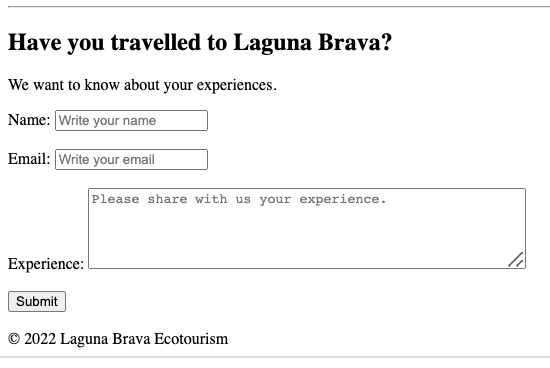

# Tutorial: Structuring the content of your website

This document describes the steps for structuring information in an HTML document. The content is based on the narrative for the [Laguna Brava Ecotourism Website](https://docs.google.com/document/d/1km0BxhWLX4hsJDRVkEDGWBFxr76Hyf_FNUubJtaPo5c/edit?usp=sharing) created following [the web design process discussed in class](https://docs.google.com/presentation/d/17QH5RDWIGE9UkEPn0g89vhl6Iw7_nao2lsCcfX6HS2o/edit?usp=sharing).

## Skills
- Structure content using HTML tags
- Improve the structure of HTML code for search engines by implementing HTML5 semantics  

Each task below provides links that explain the purpose of each HTML tag. These links point to two popular learning resources on web development:

- [Mozilla MDN web docs](https://developer.mozilla.org/en-US/docs/Web/HTML/Element). This website contains detailed and up-to-date documentation on HTML.
- [W3Schools](https://www.w3schools.com/) This website contains examples and brief explanations of HTML.

On-page Search Engine Optimization (SEO) techniques involve crafting a list of keywords that describe the most relevant and significant aspects of your web page. Here are some examples:
- Laguna Brava
- Nature
- Adventure

We will use the following text. Note the keywords are highlighted in bold.

> *Page's Title:* Welcome to **Laguna Brava** Ecotourism
>
> *Welcome blurb:* Learn everything about the activities that **Laguna Brava** offers to its visitors.
>
> *Description of activities*  
> The communities offer two activities for guided visits that allow visitors to enjoy **Laguna Brava's** natural beauty. In both activities, members of the **Laguna Brava's** community provide life vests and local guides who know the lake very well to ensure your safety.
>
> *Guided visits options*
>
> *Acitivy 1*  
> The Lake Challenge  
> Put your strengths to work by crossing the four kilometers in a kayak guided by a local guide. This **adventure** is physically demanding and recommended for only those in excellent physical condition.
> - Duration: 5 hours approx.
> - Price: USD 50
> - Minimum: 2 pax
>
> *Activity 2*  
> Sit Back & Relax  
> Admire the **nature** of **Laguna Brava** by boarding a rowing boat around the most beautiful parts of the lake. This guided visit does not require physical effort.
> - Duration: 5 hours approx.
> - Price: USD 30
> - Minimum: 4 pax

> *Description of the local communities*  
> The area around **Laguna Brava** has been inhabited by Mayan communities of the Chuj ethnicity since the 19th century. Members of these communities welcome travelers from all regions of the world looking for **adventure** and **nature**. They believe that visitors and responsible **ecotourism** practices are essential to support the development of their communities.

## Preview


## Task 1: Creating the basic structure

Fill in the \<title\> element with a descriptive title and specify UTF-8 as the character encoding set (charset) using the meta tag.
Recall this title will appear on the browser's window or tab.

```html
<html lang="en">
    <head>
        <meta charset="utf-8">
        <title>Laguna Brava Ecotourism</title>
    </head>
    <body>
    </body>
</html>
```

## Task 2: Adding the main headline

Inside the body element, create the main heading. Use the [level 1 heading](https://developer.mozilla.org/en-US/docs/Web/HTML/Element/Heading_Elements) (\<h1\>) element.

```html
<h1>Welcome to Laguna Brava Ecotourism</h1>
```

## Task 3: Adding Paragraphs and sub-headings
Structure the page's welcome blurb, general description of activities, and description of the local communities using [paragraph elements](https://developer.mozilla.org/en-US/docs/Web/HTML/Element/p) and heading elements.

You can follow the structure below:

```html
<h1>...</h1>
<p>[Welcome blurb]</p>

<!-- activities description -->
<h2>Activities</h2>
<p>
    [General description of activities ]
</p>
```

```html
<!-- Activity 1 -->
<h3>The Lake Challenge</h3>
<p>
    ...
</p>
<!-- Activity 2 -->
<h3>Sit Back & Relax</h3>
<p>
    ...
</p>
```

```html
<!-- Local communities -->
<h2>The Local Communities</h2>
<p>
    ...
</p>
```

## Task 4: Adding lists
Each guided visit option contains details organized as a list (e.g., price and minimum number of people). Use the [unordered list element](https://developer.mozilla.org/en-US/docs/Web/HTML/Element/ul) to structure this information right below the sub-heading in each activity.

```html
<h3>The Lake Challenge</h3>
<p>
...
</p>
<ul>
    <li>Duration: 5 hours approx.</li>
    <li>Price: $50 USD</li>
    <li>Minimum: 2 pax</li>
</ul>
            
```

```html
<h3>Sit Back & Relax</h3>
<p>
...
</p>
<ul>
    <li>Duration: 3 hours approx.</li>
    <li>Price: $40 USD</li>
    <li>Minimum: 4 pax</li>
</ul>
```

## Task 5: Adding links
Choose at least one word or phrase and make it a hyperlink (link) using the [anchor element](https://developer.mozilla.org/en-US/docs/Web/HTML/Element/a).

Specify the URL of another website using the hyperlink reference (href) attribute of the anchor element. HTML attributes are commonly used in HTML to provide additional information and control the content within an HTML tag.

```html
The area around Laguna Brava has been inhabited by Mayan communities of the <a href="https://en.wikipedia.org/wiki/Chuj_people">Chuj ethnicity</a> since the 19th century.
```

Notes:
- The link allows the viewer of the page to click on it and jump into the referring or target page. When this happens, you may realize that the target page opens in the same browser window.
- You may also look at how to make the hyperlink to open the target page in a browser tab or window.

## Task 6: Adding images
Add a few images using the [image element](https://developer.mozilla.org/en-US/docs/Web/HTML/Element/img). Specify the URL of the image in the source (src) property of the \ tag. 

We will use local images, which means the server will host these images. Create an *img/* in the same folder containing your *index.html* document and add the images to be included in each image tag below.

Place the image before the level 1 heading created in task 2.

```html

<h1>...</h1>
```

> Download the header image from [here](https://github.com/josecarlosgt/Web-Design-and-Development/raw/tutorial-2-designing-and-structuring-content/img/panoramic-laguna-brava-2.jpg)

 Then, add an image in each option of the guided visit. Place each image right below the sub-heading in each option (before the description text).

 ```html
<h3>The Lake Challenge</h3>

<p>
    ...            
</p>

<h3>Sit Back & Relax</h3>

<p>
    ...            
</p>
```

> Download these images from here: [kayak image](https://josecarlosgt.github.io/Web-Design-and-Development/img/kayak.jpg) and [boat image](https://josecarlosgt.github.io/Web-Design-and-Development/img/boat.jpg) 

Notes:
- The image element does not require a closing tag because this element does not enclose any content. All the information required to display an image is specified as attributes of the image element.
- To make the \ tag work, you need to add an image file and make it accessible from the folder where your index.html is located. Developers usually create an image folder named "img" or "images" that contains all the images displayed on a website. The image URL can be a relative path, e.g., "images/myimage.jpg", which means the image is served locally or an absolute path, e.g., https://josecarlosgt.github.io/Web-Design-and-Development/img/kayak.jpg, which means the image is served externally by another web server.
- You can also use the title attribute to provide additional information about the image. Most browsers will display the content of this attribute in a tooltip when the user hovers over the image.

## Task 7: Adding a web form
HTML borrows the concept of a form to refer to different elements that allow you to collect information from visitors to your site. Refer to Chapter 7: Forms (uploaded to Canvas) for a more detailed explanation of how web forms operate.

A web form consists of a form ([\<form\>](https://developer.mozilla.org/en-US/docs/Web/HTML/Element/form)) element and a combination of controls, such as input and other elements that allow the user to enter different types of data. These sites provide more information on creating web forms.

- [Form element](https://www.w3schools.com/html/html_forms.asp)
- [HTML input types](https://www.w3schools.com/html/html_form_input_types.asp)
- [Label element](https://developer.mozilla.org/en-US/docs/Web/HTML/Element/label)

Form controls serve as points on the web page that direct or control the user's interaction with the web page. The simplest form control on a web form is a text input that directs the user to key in text content, such as their name or email address.

### Preview



After the last paragraph, create a web form that requests comments from your page's viewers based on their experiences in Laguna Brava:

```html
<form>
</form>
```

Inside the form element, create a text input field to capture the user's name:
```html
<label for="name">Name: </label>
<input type="text" name="name" id="name" placeholder="Write your name">
```

Use the [break line element](https://developer.mozilla.org/en-US/docs/Web/HTML/Element/br) to produces a line break in text (carriage-return) as necessary to separate each group of elements.

```html
<br>
```

Create an email input field to capture the user's email:
```html
<label for="email">Email: </label>
<input type="email" name="email" id="email" placeholder="Write your email">
```

Use the [line break element](https://developer.mozilla.org/en-US/docs/Web/HTML/Element/br) to display each label/input pair in your form in a single line:
```html
<label for="name">Name: </label>
<input type="text" name="name" id="name" placeholder="Write your name"><br><br>
...
```

Create a [textarea](https://developer.mozilla.org/en-US/docs/Web/HTML/Element/textarea) field to capture the users' comment:
```html
<label for="experience">Experience: </label>
<textarea name="experience" id="experience" placeholder="Please share with us your experience." rows="5" cols="50"></textarea>
```

Create a submit input field to display a submit button:
```html
<input type="submit" value="Submit">
```    

Notes:
- Notice the difference between the text and email fields
- The name attribute in the input and textarea elements is useful for managing the data entered by the user in server-side programs. We will ignore this attribute for now, since we are focusing only on developing the front-end of a webpage, i.e., the code that runs in the client (web browser).
- Notice how adding [label elements](https://developer.mozilla.org/en-US/docs/Web/HTML/Element/label) and the [placeholder attribute](https://www.w3schools.com/tags/att_input_placeholder.asp) to your input text and textarea fields improve the usability of your form.
- Notice how the id attribute of the input fields relates to the for attribute of the label element.
 
Use the [horizontal rule element](https://developer.mozilla.org/en-US/docs/Web/HTML/Element/hr) to separate the form from the rest of the content in the webpage.

```html
<hr>
```

Note that the line break and horizontal rule elements (as well as the \<input\> and \) elements do not require a closing tag because these elements do not enclose any content. 

Finally, add a comment on top of the form element to state the purpose of your form using the syntax <!--  -->. Comments in HTML are not displayed to the user of the page. The purpose of comments is to explain your code, which can help you or help others to edit the source code at a later date.

```html
<!-- A form asking for page viewer's experiences -->
```

Access [this document](https://docs.google.com/document/d/1RAIx-JZjfczV0gJI_8PNTx6jgpuOi0jKEOdl4tw8HOo/edit?usp=sharing) for guidelines to add **persistence** to the web form, which will allow storing the comments from Laguna Brava Ecotourism's visitors.

## Task 8: Make your Web page HTML5
Let's improve the structure of your website by leveraging HTML5 tags.

[HTML5](https://developer.mozilla.org/en-US/docs/Glossary/HTML5) is the current specification of HTML. HTML5 introduces standards designed to facilitate the development of modern web applications and websites.

One of the main improvements introduced by HTML5 is a new set of semantic elements. The term [semantics](https://developer.mozilla.org/en-US/docs/Glossary/Semantics) refers to the meaning of a given element. Through new semantic elements, HTML5 allows web developers to describe more precisely what the content of a web page is.

The benefits of using semantic elements include:
- Screen readers can use semantic elements as signposts to help visually impaired users navigate a page.
- It allows search engines to identify relevant content on the web page, influencing the page's search rankings.
- Semantic elements also contribute to the purpose of HTML to represent content based on its structure and not on presentation (style). Presentation (i.e., how a web page should look) is the sole responsibility of CSS.
 
**The HTML5 document type declaration**

A Document Type Declaration (doctype) is an instruction to the web browser about the version of HTML in which a web page is written. Every HTML document requires a valid document type declaration to ensure that the web pages on your website are displayed the way they are intended to be displayed.

The doctype for HTML5 is very short, concise, and case-insensitive. Add the following line to the top of your index.html file to declare it as an HTML5 document.

```html
<!doctype html>
```

Many HTML semantic tags are *sectioning* elements because they create logical sections. This means they group content that is semantically related. Popular examples include:
- header
- main
- footer
- nav
- article
- section
- figure
- aside

Notes:
- The doctype declaration is usually the very first thing defined in an HTML document (even before the opening \<html\>tag); however, the doctype declaration itself is not an HTML tag.

## Task 9: Adding semantic tags (header, main, and footer)
In this task, we will be adding some of the most popular semantic tags introduced by HTML5.

[header](https://developer.mozilla.org/en-US/docs/Web/HTML/Element/header): represents introductory content and navigational aids. It may contain  heading elements, a logo, a search form, an author name, and other elements.

Use this element to enclose the lake image, the main heading, and the introductory paragraph about the lake:

```html
<header><!-- Introductory content -->            
    
    <h1>...</h1>
    <p>
        ...
    </p>
</header>
```

[main](https://developer.mozilla.org/en-US/docs/Web/HTML/Element/main): represents the dominant or primary content of a web document. This content should be unique to the document. Content that is repeated across a set of documents such as sidebars, navigation links, copyright information, site logos, and search forms shouldn't be included here. 

Enclose the content describing the activities and local communities in a main element:

```html
<main><!-- Dominant content of the web page -->
    ...
</main>
```

[footer](https://developer.mozilla.org/en-US/docs/Web/HTML/Element/footer): It typically contains copyright data or links to related documents.

Add a copyright notice at the bottom of the HTML document using the \<footer\> element right before the closing tag of the \<body\> element.

```html
<footer><!-- Defines a footer for a document or section -->
    &copy; 2023 Laguna Brava Ecotourism
</footer>
```

Notes:
- It is essential to understand the meaning of each semantic element and how these elements structure your web page's content in a way that is more descriptive.
- Although the structure of your web document represents the meaning of each piece of content better, it has not changed or improved the appearance of the webpage. To improve the appearance of a webpage to its visitors, you will use another technology different from HTML, namely CSS. CSS is the topic of the next tutorial.

## Task 10: Structuring content using articles

The [article element](https://developer.mozilla.org/en-US/docs/Web/HTML/Element/article) represents self-contained content. This means \<article\> content could be removed from the page and put on other pages and still make sense on its own. Thus, content inside an \<article\> element should be intended to be independently distributable or reusable. Content inside \<article\> is also intended to change often (e.g., online publications such as blogs, magazine articles, and event listings). Thus, this tag tells search engines the content it contains changes often and put more weight on the text it contains compared to other site elements.

Each \<article\> should be identified, typically by including a heading as a child of the \<article\> element.  

What content would you consider to structure as articles? The guided visit options are a good candidate:

```html
<article><!-- Self-contained content intended to be independently distributable -->
    <h3>...</h3>
       
    ...
    <ul>...</ul>
</article>
```

## Task 11: Structuring content using sections

The [section element](https://developer.mozilla.org/en-US/docs/Web/HTML/Element/section): represents a generic sectioning element, and should only be used if there isn't a more specific element to represent it like \<main\>, \<nav\>, or \<aside\>. 

Use the \<section\> element to create two sections: one section for the activities content and another section for description of the local communities. 

Notes:
- Although it might behave similar to the \<article\> element, if the contents of the element represent a standalone unit of content that makes sense by itself (e.g., a blog post or blog comment, or a newspaper article), the \<article\> element should be used instead.
- Sections usually have a heading element as a child
- Sections can exist inside articles to group semantically connected content inside an article or other elements
- Section can also be used to group semantically related article elements
- If you are only using the element as a styling wrapper, use \<div\> instead. As a sectioning element, a rule of thumb is that content inside \<section\> should be logically related.

> The advantage is that each section can have its separate HTML heading. This can give search engines a better understanding of how the web page is segmented and structured. Search engines might be able to interpret the information hierarchy of the HTML document based on \<section\> tags.

Reference: [HTML5 Elements That Can Affect Search Engine Indexing](https://www.webfx.com/blog/web-design/what-potential-impact-can-html5-have-on-seo/)

## Task 12: Highlithing text importance
In addition to the sectioning tags mentioned above, you can also use other elements to highlight important text, such as:

The [emphasis element](https://developer.mozilla.org/en-US/docs/Web/HTML/Element/em) represent words that have a stressed emphasis compared to surrounding text. It is often limited to a word or a few words.

Choose a word or words in your content that you think should be emphasized. For example, you can emphasize the words "responsible ecotourism practices" in the sentence: "They believe that visitors and responsible ecotourism practices are essential to support the development of their communities.":

```html
<em>responsible ecotourism practices</em>
```

The [strong element](https://developer.mozilla.org/en-US/docs/Web/HTML/Element/strong) element indicates that its contents have strong importance, seriousness, or urgency.

Choose sentences in your content that you think should be marked as serious or urgent. For example, statements about safety and the requirement of excellent physical condition for the first option of guided visits:

```html
<strong>members of the Laguna Brava's community provide life vests ...</strong>
```

These elements are preferred instead of the once glorious but now less popular [\<b\>](https://www.w3schools.com/tags/tag_b.asp) and [\<i\>](https://www.w3schools.com/tags/tag_i.asp) tags.

 ## Task 13 Adding the figure element 
 
Use the [figure element](https://developer.mozilla.org/en-US/docs/Web/HTML/Element/figure) with a caption to structure the content related to the image in each activity. Use the following statements as captions for each activity's image:
- The lake challenge activity: *Cross the four kilometers in a kayak.*
- The sit back & relax activity: *Board a rowing boat and admire the nature of Laguna Brava.*

```html
<figure>
    
    <figcaption>[caption]</figcaption>
</figure>
```

> The figure element groups together related content, contributing to the meaning (semantics) of the HTML document when compared to the image tag.

## Task 14: Adding side content
Use the [aside element](https://developer.mozilla.org/en-US/docs/Web/HTML/Element/aside) to enclose the content related to the form:

```html
<hr>	        
<aside><!-- Defines content aside from the content it is placed in -->
    ...    
    <!-- A form asking for page viewer's experiences -->	
    <form>
        ...
    </form>
</aside>
```

> The \<aside\> HTML element represents tangential information or content indirectly related to the document's central theme, such as sidebars or callout boxes.

## Task 15: Adding a navigation menu

Create add a navigation menu using the [nav element](https://developer.mozilla.org/en-US/docs/Web/HTML/Element/nav). Note the links in the navigation menu are local to the page, and they require each section to contain an id property with the same value.

```html
<nav>
    <ul>
        <li><a href="#activities">Activities</a></li>
        <li><a href="#communities">The Local Communities</a></li>
    </ul>
</nav>
```

<!-- 
## Task 15: Adding on-page SEO

Check your content against the following recommendations to improve SEO:
1. Use \<title\> with descriptive text (i.e., text contains at least one keyword)
2. Include and repeat keywords in the web page text, including heading elements
3. Use the *alt* attribute of image elements
4. Provide a description using the [meta tag](https://www.w3schools.com/tags/tag_meta.asp). Make sure you also include your keywords in the description:

```html
<meta name="description" content="Laguna Brava Ecotourism promotes sustainable travel and activities to the Laguna Brava lake in western Guatemala." />
```

The use of HTML5 semantic tags also contributes to [improving SEO](https://resources.bayshoresolutions.com/blog/html5-boosts-seo-strategy/).

You may also visit the page [How Search organizes information](https://www.google.com/search/howsearchworks/crawling-indexing/) to get a basic understanding of how Google's Search service works.

The [index.html](./index.html) file contains the final HTML document. *Compare the structure of your HTML document using traditional HTML elements (paragraphs) versus HTML5 semantic elements.*

-->
