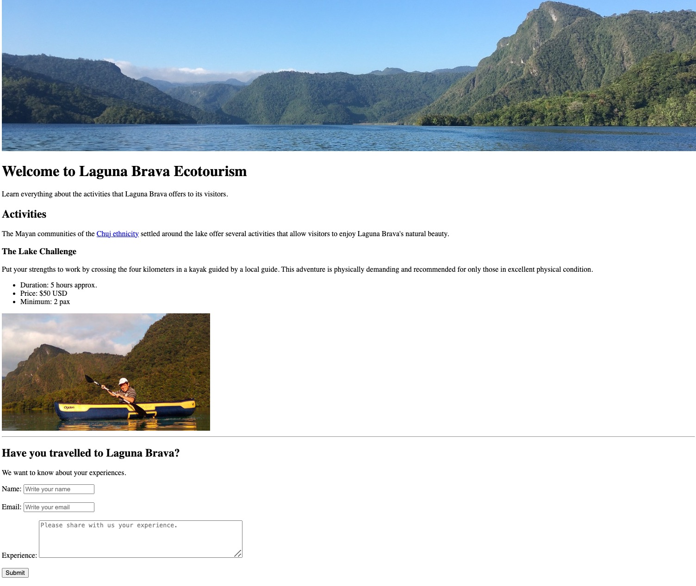

# Tutorial: Structuring the content of your website with HTML5 Semantic Tags

This document describes the steps for structuring information in an HTML document using HTML5 semantic tags. The content is based on the narrative for the [Laguna Brava Ecotourism Website](https://docs.google.com/document/d/1km0BxhWLX4hsJDRVkEDGWBFxr76Hyf_FNUubJtaPo5c/edit?usp=sharing) created following [the web design process](https://docs.google.com/presentation/d/17QH5RDWIGE9UkEPn0g89vhl6Iw7_nao2lsCcfX6HS2o/edit?usp=sharing) discussed in class.

## Skills
- Optimize Web content by applying on-page SEO techniques
- Structure content using HTML5 Semantic tags

Each task below provides links that explain the purpose of each HTML tag. These links point to two popular learning resources on web development:

- [Mozilla MDN web docs](https://developer.mozilla.org/en-US/docs/Web/HTML/Element). This website contains detailed and up-to-date documentation on HTML.
- [W3Schools](https://www.w3schools.com/) This website contains examples and brief explanations of HTML.

## Preview



Download the [base.html](base.html) and [images in the img folder](img/) to complete the following tasks.

## Part I: On-page SEO
On-page Search Engine Optimization (SEO) techniques involve crafting a list of keywords that describe the most relevant and significant aspects of your web page. 

## Task 1: Optimizing the content for keywords
For this page, we will use the following two keywords:
- Laguna Brava
- Things to do

Ensure the page's title and main heading contain the target keywords above.

```html
    ...
    <title>Things to Do in Laguna Brava</title>
    ...
    <h1>Things to Do in Laguna Brava</h1>
    ...
```

> The target keywords should also appear on the web page text. You may also visit the page [How Search organizes information](https://www.google.com/search/howsearchworks/crawling-indexing/) to get a basic understanding of how Google's Search service works.

## Task 2: Add the meta description tag
Provide a description using the [meta tag](https://www.w3schools.com/tags/tag_meta.asp). Make sure you also include your keywords in the description.

```html
<meta name="description" content="Your guide for things to do and activities in  Laguna Brava lake in western Guatemala.">
```

## Task 3: Add image descriptions
Search engines rely on you providing accurate descriptions of images in the alt text. This will also help your images show up in the results of image-based searches.

```html
    ...
    
    ...
    
    ...
    
    ...
...
```

## Part II: HTML5 Semantic Tags
The use of HTML5 semantic tags also contributes to [improving SEO](https://resources.bayshoresolutions.com/blog/html5-boosts-seo-strategy/).

[HTML5](https://developer.mozilla.org/en-US/docs/Glossary/HTML5) is the current specification of HTML. HTML5 introduces standards designed to facilitate the development of modern web applications and websites.

One of the main improvements introduced by HTML5 is a new set of semantic elements. The term [semantics](https://developer.mozilla.org/en-US/docs/Glossary/Semantics) refers to the meaning of a given element. Through new semantic elements, HTML5 allows web developers to describe more precisely what the content of a web page is.

The benefits of using semantic elements include:
- Screen readers can use semantic elements as signposts to help visually impaired users navigate a page.
- It allows search engines to identify relevant content on the web page, influencing the page's search rankings.
- Semantic elements also contribute to the purpose of HTML to represent content based on its structure and not on presentation (style). Presentation (i.e., how a web page should look) is the sole responsibility of CSS.

Let's improve the structure of your website by leveraging HTML5 tags.

## Task 4: Make your Web page HTML5
 
**The HTML5 document type declaration**

A Document Type Declaration (doctype) is an instruction to the web browser about the version of HTML in which a web page is written. Every HTML document requires a valid document type declaration to ensure that the web pages on your website are displayed the way they are intended to be displayed.

The doctype for HTML5 is very short, concise, and case-insensitive. Add the following line to the top of your index.html file to declare it as an HTML5 document.

```html
<!doctype html>
```

> The doctype declaration is usually the very first thing defined in an HTML document (even before the opening \<html\>tag); however, the doctype declaration itself is not an HTML tag.

## Task 5: Adding the header, main, and footer semantic tags
In this task, we will be adding some of the most popular semantic tags introduced by HTML5.

[header](https://developer.mozilla.org/en-US/docs/Web/HTML/Element/header): represents introductory content and navigational aids. It may contain  heading elements, a logo, a search form, an author name, and other elements.

Use this element to enclose the lake image, the main heading, and the introductory paragraph about the lake:

```html
<header><!-- Introductory content -->            
    
    <h1>...</h1>
    <p>
        ...
    </p>
</header>
```

[main](https://developer.mozilla.org/en-US/docs/Web/HTML/Element/main): represents the dominant or primary content of a web document. This content should be unique to the document. Content that is repeated across a set of documents such as sidebars, navigation links, copyright information, site logos, and search forms shouldn't be included here. 

Enclose the content describing the activities and local communities in a main element:

```html
<main><!-- Dominant content of the web page -->
    ...
</main>
```

[footer](https://developer.mozilla.org/en-US/docs/Web/HTML/Element/footer): It typically contains copyright data or links to related documents.

Add a copyright notice at the bottom of the HTML document using the \<footer\> element right before the closing tag of the \<body\> element.

```html
<footer><!-- Defines a footer for a document or section -->
    &copy; 2023 Laguna Brava Ecotourism
</footer>
```

Notes:
- It is essential to understand the meaning of each semantic element and how these elements structure your web page's content in a way that is more descriptive.
- Although the structure of your web document represents the meaning of each piece of content better, it has not changed or improved the appearance of the webpage. To improve the appearance of a webpage to its visitors, you will use another technology different from HTML, namely CSS. CSS is the topic of the next tutorial.

## Task 6: Sectioning content using \<section\>

The [section element](https://developer.mozilla.org/en-US/docs/Web/HTML/Element/section): represents a generic sectioning element, and should only be used if there isn't a more specific element to represent it like \<main\>, \<nav\>, or \<aside\>. 

Use the \<section\> element to create two sections: one section for the activities content and another section for description of the local communities. 

Notes:
- Section can also be used to group semantically related article elements
- If you are only using the element as a styling wrapper, use \<div\> instead. As a sectioning element, a rule of thumb is that content inside \<section\> should be logically related.
- Although it might behave similar to the \<article\> element, if the contents of the element represent a standalone unit of content that makes sense by itself (e.g., a blog post or blog comment, or a newspaper article), the \<article\> element should be used instead.
- Sections usually have a heading element as a child
- Sections can exist inside articles to group semantically connected content inside an article or other elements

> The advantage is that each section can have its separate HTML heading. This can give search engines a better understanding of how the web page is segmented and structured. Search engines might be able to interpret the information hierarchy of the HTML document based on \<section\> tags.

Reference: [HTML5 Elements That Can Affect Search Engine Indexing](https://www.webfx.com/blog/web-design/what-potential-impact-can-html5-have-on-seo/)

## Task 7: Adding side content
Use the [aside element](https://developer.mozilla.org/en-US/docs/Web/HTML/Element/aside) to enclose the content related to the form:

```html
<hr>	        
<aside><!-- Defines content aside from the content it is placed in -->
    ...    
    <!-- A form asking for page viewer's experiences -->	
    <form>
        ...
    </form>
</aside>
```

> The \<aside\> HTML element represents tangential information or content indirectly related to the document's central theme, such as sidebars or callout boxes.

## Task 8: Sectioning content using \<article\>

The [article element](https://developer.mozilla.org/en-US/docs/Web/HTML/Element/article) represents self-contained content. This means \<article\> content could be removed from the page and put on other pages and still make sense on its own. Thus, content inside an \<article\> element should be intended to be independently distributable or reusable. Content inside \<article\> is also intended to change often (e.g., online publications such as blogs, magazine articles, and event listings). Thus, this tag tells search engines the content it contains changes often and put more weight on the text it contains compared to other site elements.

Each \<article\> should be identified, typically by including a heading as a child of the \<article\> element.  

What content would you consider to structure as articles? The guided visit options are a good candidate:

```html
<article><!-- Self-contained content intended to be independently distributable -->
    <h3>...</h3>
       
    ...
    <ul>...</ul>
</article>
```

## Task 9: Emphasizing important text 
In addition to the sectioning tags mentioned above, you can also use other elements to highlight important text, such as:

The [emphasis element](https://developer.mozilla.org/en-US/docs/Web/HTML/Element/em) represent words that have a stressed emphasis compared to surrounding text. It is often limited to a word or a few words.

Choose a word or words in your content that you think should be emphasized. For example, you can emphasize the words "responsible ecotourism practices" in the sentence: "They believe that visitors and responsible ecotourism practices are essential to support the development of their communities.":

```html
<em>responsible ecotourism practices</em>
```

The [strong element](https://developer.mozilla.org/en-US/docs/Web/HTML/Element/strong) element indicates that its contents have strong importance, seriousness, or urgency.

Choose sentences in your content that you think should be marked as serious or urgent. For example, statements about safety and the requirement of excellent physical condition for the first option of guided visits:

```html
<strong>In both activities, members of the Laguna Brava's community provide life vests ...</strong>
```

These elements are preferred instead of the once glorious but now less popular [\<b\>](https://www.w3schools.com/tags/tag_b.asp) and [\<i\>](https://www.w3schools.com/tags/tag_i.asp) tags.

 ## Task 10: Adding the figure element 
 
Use the [figure element](https://developer.mozilla.org/en-US/docs/Web/HTML/Element/figure) with a caption to structure the content related to the image in each activity. Use the following statements as captions for each activity's image:
- The lake challenge activity: *Cross the four kilometers in a kayak.*
- The sit back & relax activity: *Board a rowing boat and admire the nature of Laguna Brava.*

```html
<figure>
    
    <figcaption>[caption]</figcaption>
</figure>
```

> The figure element groups together related content, contributing to the meaning (semantics) of the HTML document when compared to the image tag.

## Task 11: Adding a navigation menu

Create add a navigation menu using the [nav element](https://developer.mozilla.org/en-US/docs/Web/HTML/Element/nav). Note the links in the navigation menu are local to the page, and they require each section to contain an id property with the same value.

```html
<nav>
    <ul>
        <li><a href="#activities">Activities</a></li>
        <li><a href="#communities">The Local Communities</a></li>
    </ul>
</nav>
```